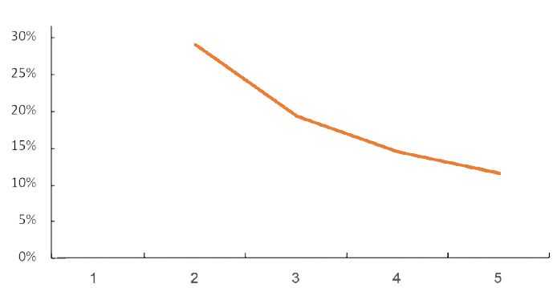
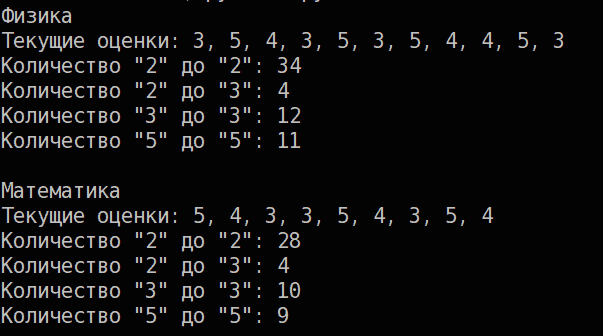

Как правило в образовательных учреждениях выставляют итоговую оценку исходя из среднего арифметического. 

# Как работает средний балл
Рассмотрим изменение среднего балла при выставлении новой оценки.

Текущие оценки    | Новая оценка | Был средний балл| Стал средний балл| Изменение среднего балла
------------------|:------------:|:---------------:|:----------------:|:------------------------:
`5`               | `2`          | `5,0`           | `3,5`            | 30%
`5`, `5`          | `2`          | `5,0`           | `4`              | 20%
`5`, `5`, `5`     | `2`          | `5,0`           | `4,25`           | 15%
`5`, `5`, `5`, `5`| `2`          | `5,0`           | `4,4`            | 12%

По данной таблице видно что **изменение среднего бала зависит от количества оценок**. Чем больше оценок есть тем больше оценок нужно получить чтобы изменить средний балл. То есть если оценок много, то изменить средний балл тяжело.



На этом графике по оси X - количество оценок, по оси Y - изменение среднего балла.

# Анализ оценок
Скрипт поможет ученику определить стабильность среднего балла и правильно распределить усилия для достижения наилучшей успеваемости. 

Рассмотрим пример. 
* Текущие оценки: 3, 3, 3, 2, 3, 4, 4, 4, 4, 4, 2, 2, 3, 3, 3, 2, 2, 2, 3, 3, 4, 4, 2, 2.
* Средний балл: `2,958`

Определить настоящую успеваемость опираясь только на средний балл довольно тяжело. *Сколько нужно стараться чтобы поднять средний балл?* - на этот вопрос отвечает скрипт.

В данном случае:
* Для повышения среднего балла до `четверки` нужно получить либо 9 `пятерок`, либо 26 `четверок`.
* Для того чтобы балл упал до `двойки` нужно получить 23 `двойки`.

# Использование скрипта
В файле `marks.txt` напишите ваши оценки в таком формате:
```
Называние предмета 435345
```
На одной строке должен быть только один предмет с оценками. Название предмета указывать не обязательно. Запустите файл `main.py` и вы увидите статистику среднего балла.

# Установка скрипта
1. Установите [python](https://www.python.org)
2. Скачайте файл `main.py` и `marks.txt`
3. Отредактируйте файл `marks.txt`
4. Запустите файл `main.py` с помощью python

## Пример
Файл `marks.txt`:
```
Физика 35435354453
Математика 543354354
```

Результат работы Скрипта:

